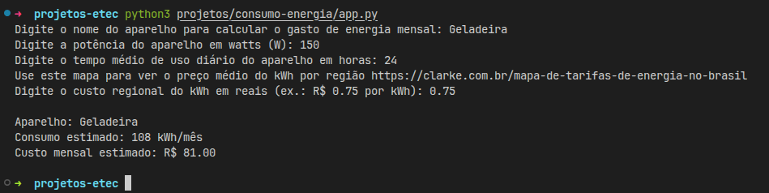

# Aplicativo que mede consumo mensal de energia de um aparelho

| Nome | Descrição |
| --- | --- |
| Nome do app | `consumo-energia` |
| Objetivo | Fazer uma previsão de quanto custaria manter mensalmente um aparelho dado seu consumo elétrico em Watts. |
| Linguagem utilizada | 
| Fórmula utilizada no cálculo | `(potencia_aparelho * tempo_uso_medio_diario * 30) / 1000` |
| Instruções para executar o programa | `python3 projetos/consumo-energia/app.py` |
| Tecnologias utilizadas |   

## 💡 Explicação detalhada
---
### ⚙️ Uso do script
O script faz 4 perguntas `inputs`, são elas:
- O nome do aparelho, por exemplo Geladeira.
- A potência em Watts do aparelho para calcular.
- O tempo médio que o aparelho é usado durante o dia em horas.
- Ele solicita o custo do kWh na região, para um cálculo mais próxima da realidade, dependendo da região da pessoa.

### 🤔 Como essas informações são utilizadas

No `processamento`, essas informações são utilizadas para calcular o custo na conta de energia do aparelho no mês, então os valores são armazenados em variáveis como `potencia_aparelho` e `tempo_uso_medio_diario` e compõem a fórmula a seguir:

```python
(potencia_aparelho * tempo_uso_medio_diario * 30) / 1000
```
---

### 👟 Execução do script e funcionamento
Com o python versão 3+ instalado, execute no terminal dentro do projeto clonado:
```sh
python3 projetos/consumo-energia/app.py
```
Com o app em execução, você será verá as perguntas acima, e responda com base no que quer calcular, dessa forma:

