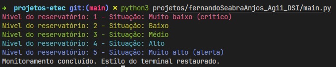

# Controle de Níveis de Água

Este script Python tem por objetivo vincular mensagens de criticidade do nível de água de um reservatório com uma respectiva cor.
Isso é feito através de um loop com todos os níveis de água, `1 até 5`, dentro de uma matriz 2D:
```python
matriz_cores = [
        [Fore.RED, "Muito baixo (crítico)"],
        [Fore.YELLOW, "Baixo"],
        [Fore.GREEN, "Médio"],
        [Fore.CYAN, "Alto"],
        [Fore.BLUE, "Muito alto (alerta)"]
    ]
```
Onde a seleção das cores é feito por meio da primeira coluna `matriz_cores[0][n]`, e a mensagem vinculada àquela cor está na segunda coluna `matriz_cores[n][0]`, a função que retorna as cores e a situação, apenas recebe o nível como argumento, e cada nível recebido se traduz no retorno correto de cor e situação, na qual são exibidos para o usuário.

> 💡 ****Porque do uso de matriz****  
> Eu resolvi usar matrizes para treinar com base na aula passada.

## Como executar o script

Execute o script da seguinte forma:
```bash
python3 projetos/fernandoSeabraAnjos_Ag11_DSI/main.py
```
## Retorno esperado

