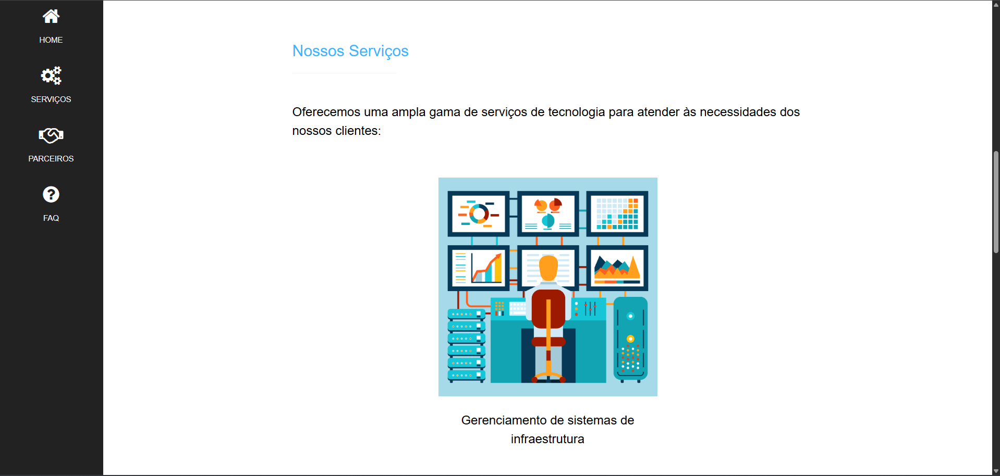
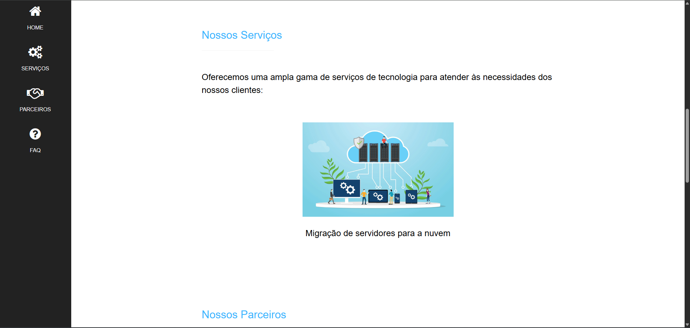
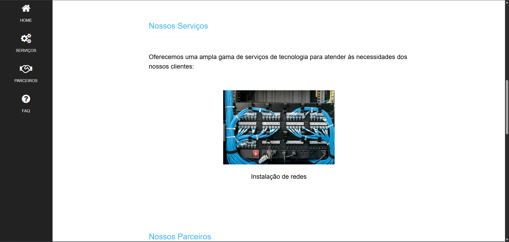
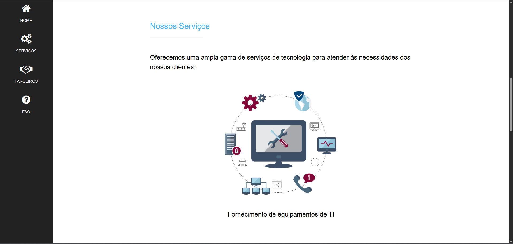
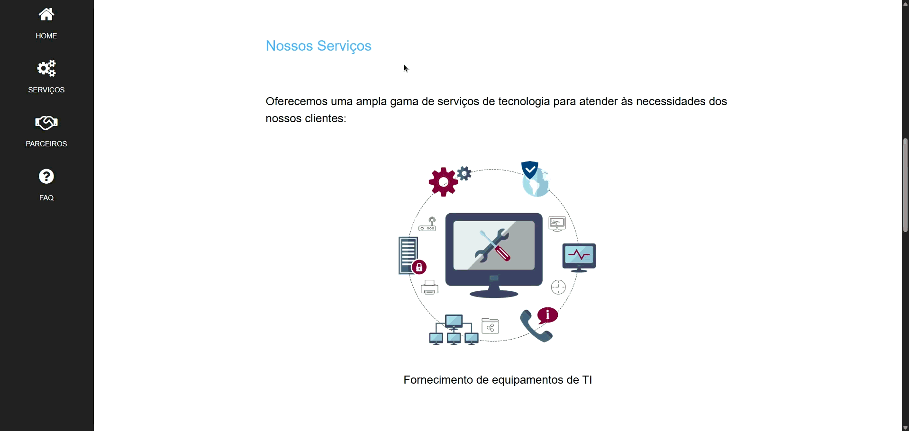
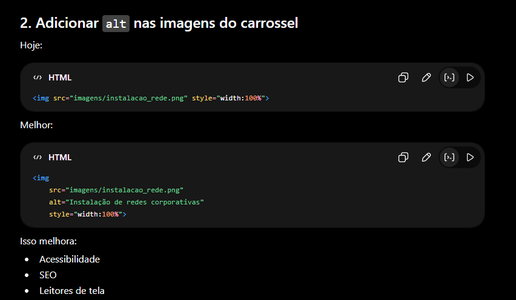
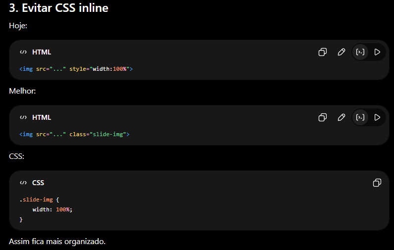

# Relatório do site e análise da IA

Assim ficou o site rodando com a troca de imagens, cada um com uma animação diferente:

---
## Animação do site:

---
## Melhorias sugeridas pela IA
### Usar atributo alt nas tags Images:  

### Evitar CSS inline

> Houveram outras melhorias sugeridas para o JavaScript