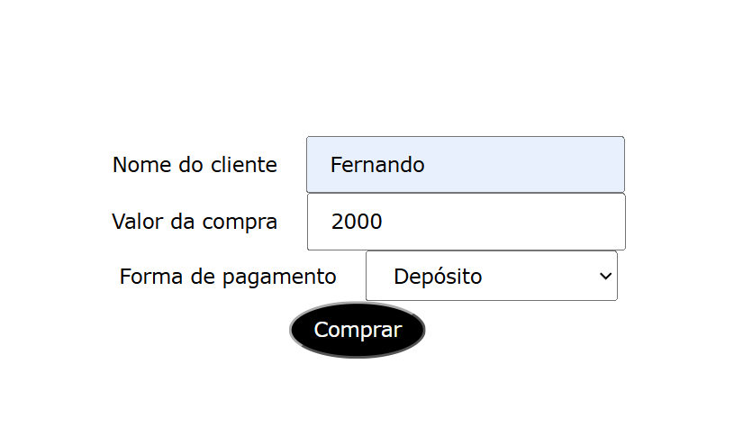
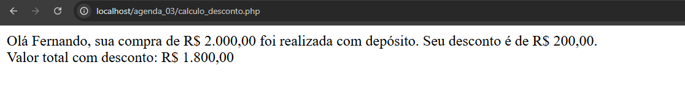
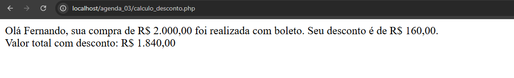
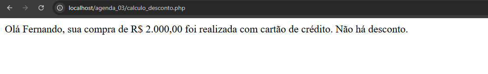

# Formulário de pagamento

## Formulário em funcionamento:  

## Método de deposito
Tem como objetivo mostrar o preço final aplicando um desconto de 10%

## Método de boleto
Tem como objetivo mostrar o preço final aplicando um desconto de 8%

## Método de cartão de crédito
Tem como objetivo mostrar o preço final sem desconto.  
